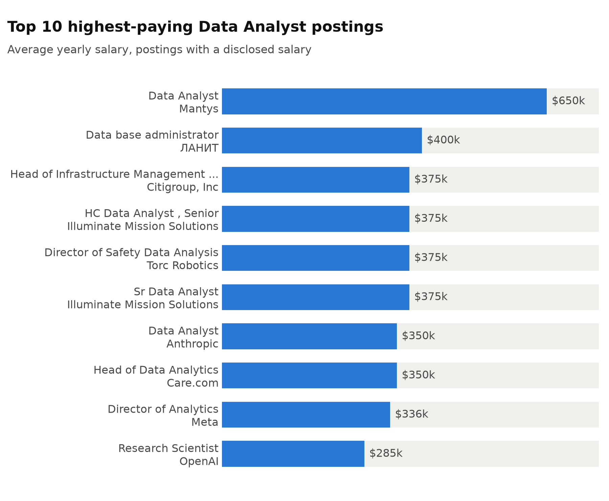
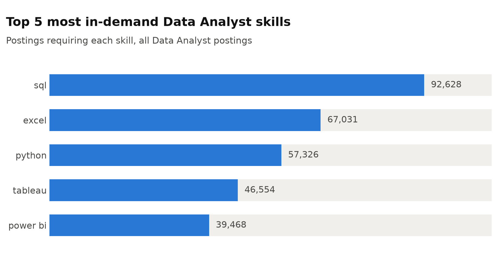
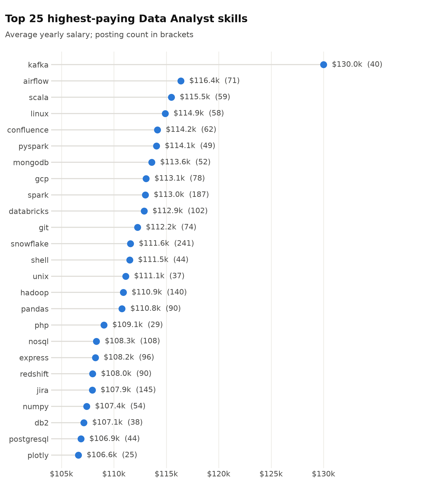
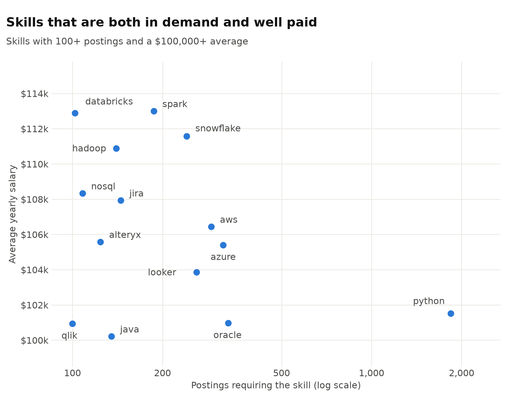

# Data Analyst Job Market: A SQL Analysis

## Introduction

This project examines the 2023 job posting market for Data Analyst roles: which
postings have higher salaries and which skills are demanded in those postings, which skills are most
in demand, which pay best, and which combine both.

The dataset comes from [Luke Barousse's SQL for Data Analytics course](https://github.com/lukebarousse/SQL_Project_Data_Job_Analysis),
which collects job postings scraped from Google's job search results. The SQL in
this repository, the analysis, and the charts are my own work.

SQL queries: [project_sql/](project_sql/)

## Background

The data is loaded into a local PostgreSQL database as four tables:

| Table | Contents |
|---|---|
| `job_postings_fact` | one row per posting: title, salary, location, remote working availability |
| `company_dim` | company names |
| `skills_dim` | one row per skill: `skill_id`, name, type |
| `skills_job_dim` | bridge table: one row per (posting, skill) pair |

### Five questions, one query file each:

1. What are the top-paying Data Analyst postings?
2. What skills do those top-paying postings require?
3. Which skills are most in demand for Data Analysts?
4. Which skills are associated with the highest average salaries?
5. Which skills are both in demand and well paid?

**Scope note.** Questions 4 and 5 restrict to postings that disclose a salary. That is a reduced posting number, so the counts in those queries are much
lower than the calculated demand figures in question 3. No filtering by location is applied.

## Tools I Used

- **PostgreSQL 18** running locally (in pgAdmin 4), as the database engine for every query.
- **VS Code** for writing and executing SQL, connected to the local database
  through the SQLTools extension.
- **Python** (matplotlib, pandas) for the charts, in a virtual environment in this
  repository. See [charts/make_charts.py](charts/make_charts.py).
- **Git and GitHub** for version control and publishing.

## The Analysis

### 1. Top-paying Data Analyst postings

Filtered to `Data Analyst` postings with a disclosed salary only and took the ten
highest.

```sql
SELECT job_id,
        job_title,
        salary_year_avg,
        name AS company_name
FROM job_postings_fact as jpf
LEFT JOIN company_dim as cd ON jpf.company_id = cd.company_id
WHERE salary_year_avg IS NOT NULL
        AND job_title_short = 'Data Analyst'
ORDER BY salary_year_avg DESC
LIMIT 10
```



- **The range is wide:** $285,000 to $650,000 ($365,000 spread).
- If one removes the first suspiciously high posting, the salary spread reduces to $115,000 wide ($285,000 to $400,000) - **a single row is responsible for most of the salary spread**.
- Titles are **mostly senior or leadership**: Director, Head of, Principal, Senior.
  "Data Analyst" as a plain title without seniority level occurs only twice.
- The top entry from Mantys is suspiciously high ($250,000 higher than the next posting). The second, "Data base administrator", is a database administration
  role that the **`job_title_short` classifier has grouped wrongly under Data Analyst**. The same false grouping applies to the "Research Scientist".
- "Illuminate Mission Solutions" company appears twice, both times at $375,000. **One employer supplies a fifth of the top ten salaries.**

### 2. Skills required by the top-paying postings

Reused query 1 as a CTE, then joined through the bridge table to get each posting's skills. Limited to 10 results.

```sql
WITH top_paying_jobs AS (
    SELECT job_id,
        job_title,
        salary_year_avg,
        name AS company_name
    FROM job_postings_fact as jpf
    LEFT JOIN company_dim as cd ON jpf.company_id = cd.company_id
    WHERE salary_year_avg IS NOT NULL
        AND job_title_short = 'Data Analyst'
    ORDER BY salary_year_avg DESC
    LIMIT 10)

SELECT tpj.*, sd.skills
FROM top_paying_jobs AS tpj
INNER JOIN skills_job_dim AS sjd ON tpj.job_id = sjd.job_id
INNER JOIN skills_dim AS sd ON sjd.skill_id = sd.skill_id
ORDER BY tpj.salary_year_avg DESC
```
### Results:
| Skill | Postings (of 7) |
|---|---|
| python | 4 |
| sql | 3 |
| r | 3 |
| excel | 3 |
| tableau | 3 |
| power bi | 2 |

- The `INNER JOIN` reduces ten postings to seven. **Three of the top ten postings contain no skills at all.**
- **Python leads at 4 of 7 postings**; SQL, R, Excel, and Tableau each appear in 3.
- No skill is required by all seven postings - the highest count is 4, so even at the very top of the pay range **there is no requirement to master all skills**.

### 3. Most in-demand skills

Counted postings per skill across all Data Analyst postings, with no salary filter, and picked the top 5.

```sql
SELECT sd.skill_id, sd.skills, COUNT(jpf.job_id) AS job_count
FROM skills_dim AS sd
INNER JOIN skills_job_dim AS sjd ON sjd.skill_id = sd.skill_id
INNER JOIN job_postings_fact AS jpf ON jpf.job_id = sjd.job_id
WHERE jpf.job_title_short = 'Data Analyst'
GROUP BY sd.skills, sd.skill_id
ORDER BY job_count DESC
LIMIT 5
```



- **SQL** is required by 92,628 postings, **38% more than the second top skill**.
- The top five splits into **three groups**: two **languages (SQL, Python)**, one
  **spreadsheet tool (Excel)**, and two **BI tools (Tableau, Power BI)**.
- Excel (67,031) outranks Python (57,326) by 17%. The second most demanded tool for a Data Analyst is **spreadsheet software, not a programming language**.
- There is no sudden count drop inside this listing (from 14% to 28% decline rate), so **no skills seem to be optional ones here**.

### 4. Skills associated with the highest salaries

Average salary per skill, restricted to postings with a disclosed salary. I added
`HAVING COUNT(*) >= 25` and a visible posting count for clarity. Without a defined job count minimum, the top of this ranking was filled with non-representative skills.

```sql
SELECT sd.skills,
    ROUND(AVG(salary_year_avg),0) AS avg_salary_per_skill,
    COUNT(*) AS postings_count
FROM skills_dim AS sd
INNER JOIN skills_job_dim AS sjd ON sd.skill_id = sjd.skill_id
INNER JOIN job_postings_fact AS jpf ON jpf.job_id = sjd.job_id
WHERE jpf.job_title_short = 'Data Analyst'
    AND salary_year_avg IS NOT NULL
GROUP BY sd.skills
HAVING COUNT(*) >= 25
ORDER BY avg_salary_per_skill DESC
LIMIT 25
```



- The spread is evidently narrow: $106,603 to $129,999, about 22% from bottom to top, with Kafka the only skill clearly separated from the rest. **Positions 2 to 25 sit within a 9% salary band.**
- **The list consists of skills mostly related to data engineering, not data analysis**. Distributed processing (Kafka, Spark, PySpark, Hadoop, Scala, Databricks), cloud platforms (GCP, Snowflake, Redshift), databases (MongoDB, NoSQL, DB2, PostgreSQL), and orchestration (Airflow) make up roughly two thirds of it.
- Also engineering workflow tools appear in the list (like Git, Confluence or Jira). These are **less typical for a standard analysis occupation**.
- None of the five skills from Query 3 (most in-demand skills) appear here, so every one of them averages below the $106,603 of the last position of the Query 4 list (Plotly). Query 5 sharpens it further: of those five, **only Python reaches even a $100,000 average**.
- **Skill rarity seems to correlate with high pay**: Kafka is required by only 40 postings, Airflow 71, Scala 59. Only six skills of the total 25 reach 100 postings at all.
- **None of the five best-paying skills is an analysis tool.** Kafka ($129,999) is a streaming platform, Airflow ($116,387) a pipeline scheduler, Scala ($115,480) a programming language, Linux ($114,883) an operating system and Confluence ($114,153) a documentation tool. The very top of the pay range describes the environment the work runs in, not the analysis itself. Kafka also stands $13,612 above second-placed Airflow, by far the largest gap between two neighbours anywhere in this list.

### 5. Skills that are both in demand and well paid

Demand and salary could be calculated from the same grouped row set (grouped by skills), so one `GROUP BY` produces both needed information pieces. A minimum of 100 postings was used as a filter to remove non-representative job offers, together with a minimum average salary of $100,000, so that only skills in the high-pay range remain.

First a query sorted by salary first, by demand count second:

```sql
SELECT sd.skills,
        COUNT(jpf.job_id) AS demand_count,
        ROUND(AVG(jpf.salary_year_avg),0) AS avg_salary_per_skill
FROM skills_dim AS sd
INNER JOIN skills_job_dim AS sjd ON sjd.skill_id = sd.skill_id
INNER JOIN job_postings_fact AS jpf ON jpf.job_id = sjd.job_id
WHERE jpf.job_title_short = 'Data Analyst'
        AND jpf.salary_year_avg IS NOT NULL
GROUP BY sd.skills
HAVING COUNT(jpf.job_id) >= 100
        AND AVG(jpf.salary_year_avg) >= 100000
ORDER BY avg_salary_per_skill DESC, demand_count DESC
```

The same query sorted by the reversed measure:

```sql
SELECT sd.skills,
        COUNT(jpf.job_id) AS demand_count,
        ROUND(AVG(jpf.salary_year_avg),0) AS avg_salary_per_skill
FROM skills_dim AS sd
INNER JOIN skills_job_dim AS sjd ON sjd.skill_id = sd.skill_id
INNER JOIN job_postings_fact AS jpf ON jpf.job_id = sjd.job_id
WHERE jpf.job_title_short = 'Data Analyst'
        AND jpf.salary_year_avg IS NOT NULL
GROUP BY sd.skills
HAVING COUNT(jpf.job_id) >= 100
        AND AVG(jpf.salary_year_avg) >= 100000
ORDER BY demand_count DESC, avg_salary_per_skill DESC
```

Both measures are shown at once on a scatter chart, because a ranked list is able to sort by only one of them. The x axis is logarithmic, as the posting counts span 100 to 1,840.



- **Only 14 skills fulfill both requirements.** Setting a filter of 100 postings and a $100,000 average removes most of the entire skill list.
- **Only one of the five most demanded skills belongs to this list.** Comparing this chart with Query 3 (most in-demand skills): only Python appears, while SQL, Excel, Tableau and Power BI do not reach a $100,000 average at all.
- **Python is a clear chart "outsider".** It has 1,840 postings against 332 for the next skill in this list, a 5.5-fold gap, but at $101,512 it is the fourth lowest paid of the 14. The most requested skill in this group is also one of the worst paid for.
- **Without Python, the rest is a small-range data point cloud.** The other 13 skills lie within range of 100 to 332 posting counts and $100,214 to $113,002 salary range, in other words a 3.3-fold demand range and a 13% pay range.
- **The upper edge of the chart represents data infrastructure competencies.** The five best paid are Spark ($113,002), Databricks ($112,881), Snowflake ($111,578), Hadoop ($110,888) and NoSQL ($108,331), all of them represent distributed processing or data storage tools.
- **Snowflake sits furthest toward the top right**, which makes it a quite desirable (241 postings) and well-paid skill (at $111,578, the third highest pay in the group). With $113,002 Spark pays the most, but is less asked for than Snowflake (187 postings). 
- **The group goes beyond data engineering.** Jira represents project tracking, Looker and Qlik are BI tools, and Alteryx is a low-code analytics platform. Unlike the Query 4 list, this one is not purely a data engineering set.

## Conclusions

1. **The most demanded skills and the best-paid skills are two different data sets, that don't have much in common.**
   SQL, Excel, Python, Tableau, and Power BI top the demand ranking and none of them reaches the top 25 by salary. They can be seen as minimum requirement for the job postings. Query 5 filters both requirements, at 100 postings and a $100,000 salary average, and of the five most demanded skills only Python managed to pass the filter. The other four fail in terms of pay.
2. **The best-paid skills belong to the data engineering competencies.** Distributed processing, cloud platforms, orchestration, and the surrounding workflow tools dominate the top-paying list. The best-paid Data Analyst or rather Data Analyst related postings are ones that also require data pipeline tasks.
3. **SQL is the biggest entry requirement.** 92,628 postings ask
   for it, more than any other skill, even more than Tableau and Power BI
   combined. Yet its $96,435 is below every single skill in the top 25 by
   salary, the lowest of which is Plotly at $106,603. So it can be seen as a mandatory skill to have, not necessarily the one that boosts the salary.
4. **Snowflake, Spark, and Databricks are the strongest "middle field"**, each
   above $111,000 with 100 or more postings. These are useful skills to learn to boost the salary range and have a good chance for acquiring a position. Snowflake sits furthest toward the top right of the Query 5 chart, at 241 postings and $111,578 and wins the demand-to-pay ratio.

### Limitations of this analysis

- `skills_dim` contains a few duplicate skill names under different `skill_id` values, so grouping by `skill_id` and grouping by name give slightly different results. These queries group by name.
- Results are "sensitive" to the thresholds/filters used (25 postings in Query 4, and 100 postings with a $100,000 average in Query 5). Different thresholds can reorder the results significantly.
- The `job_title_short = 'Data Analyst'` filter is imprecise. Query 1 shows two non-analyst roles, so every count and average in this project carries some risk of misclassified information.

## Reproducing the charts

The charts are generated from the query results committed in
[charts/data/](charts/data/), so they can be rebuilt without a database
connection.

```bash
python -m venv .venv
.venv/Scripts/python -m pip install -r requirements.txt   # Windows
# .venv/bin/python -m pip install -r requirements.txt     # macOS / Linux

.venv/Scripts/python charts/make_charts.py
```

PNGs are written to [assets/](assets/).
